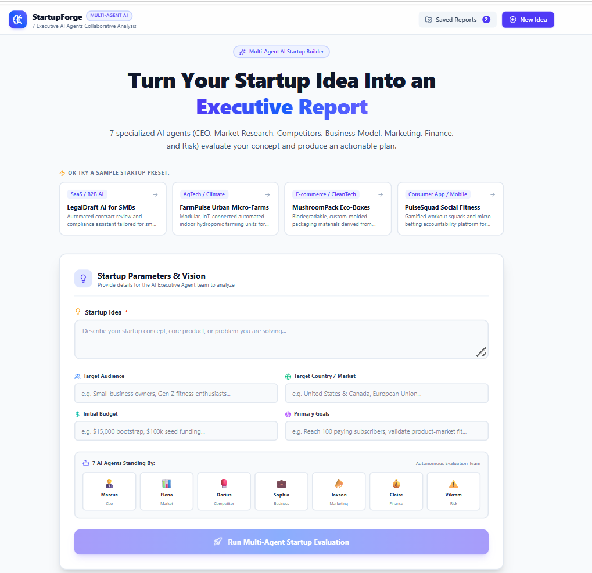
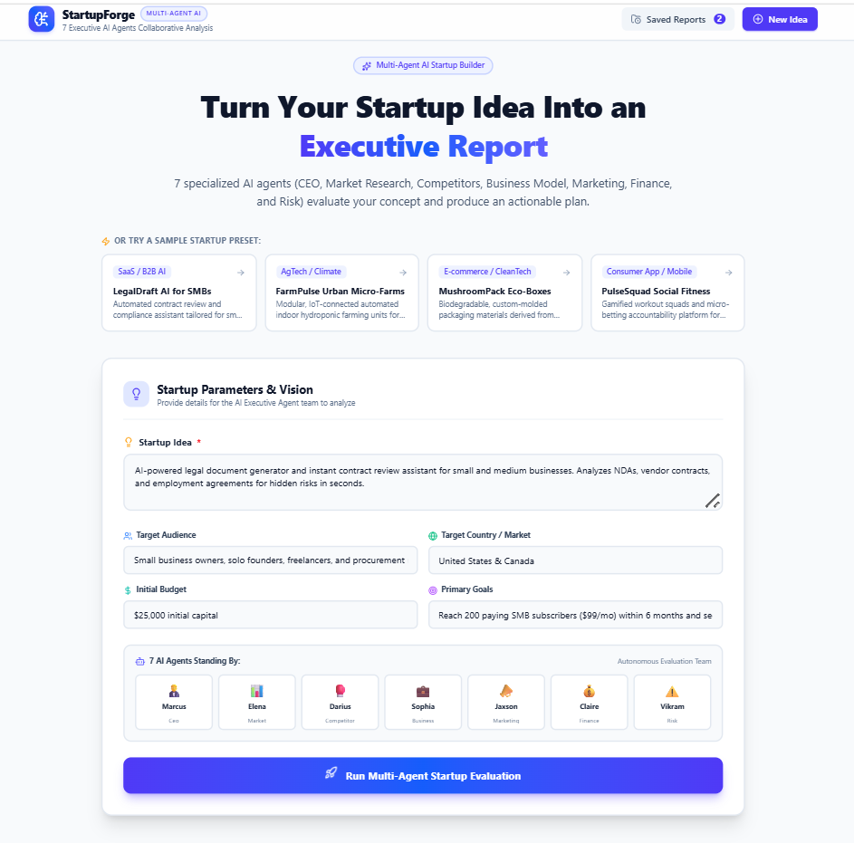
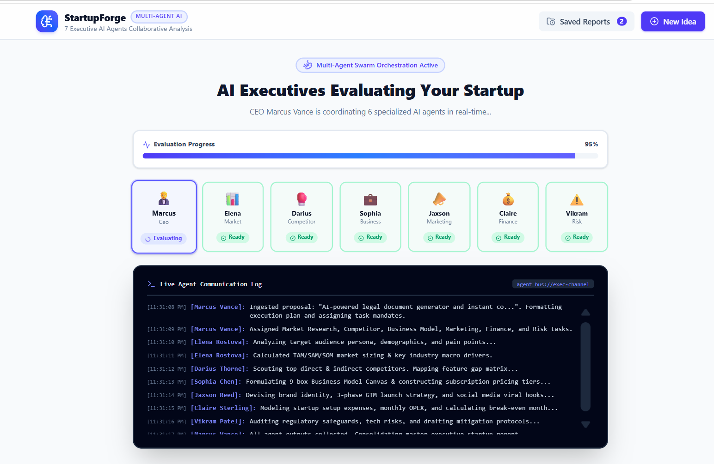
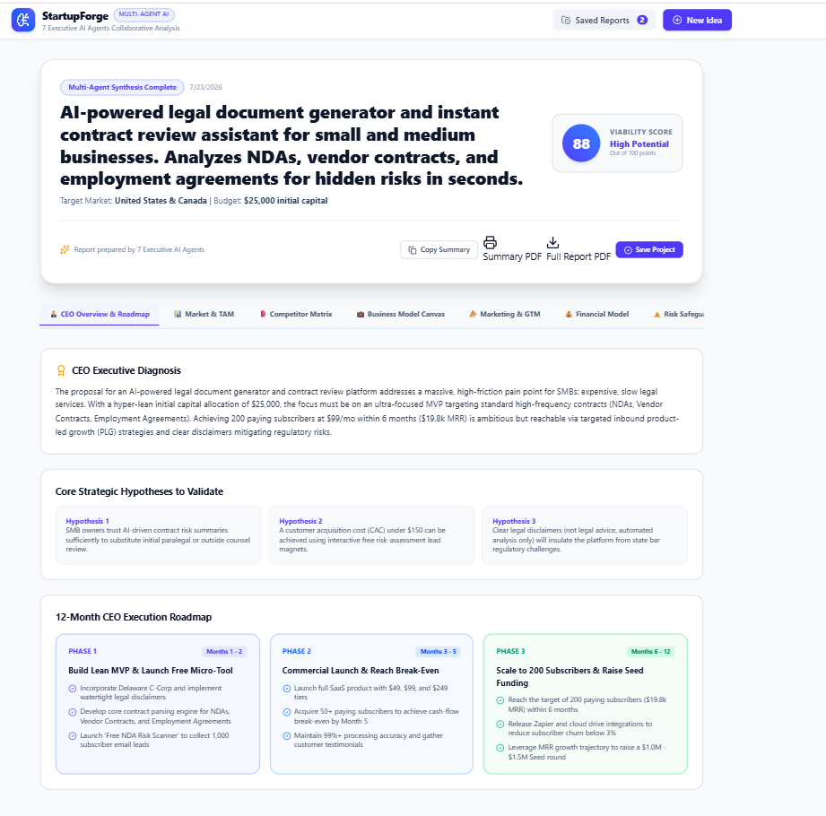
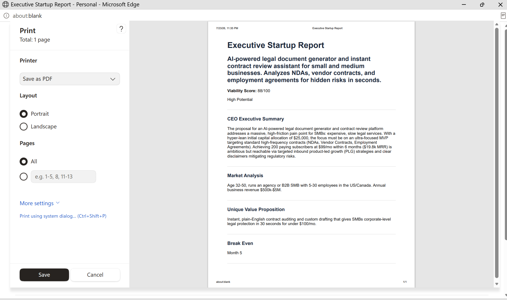
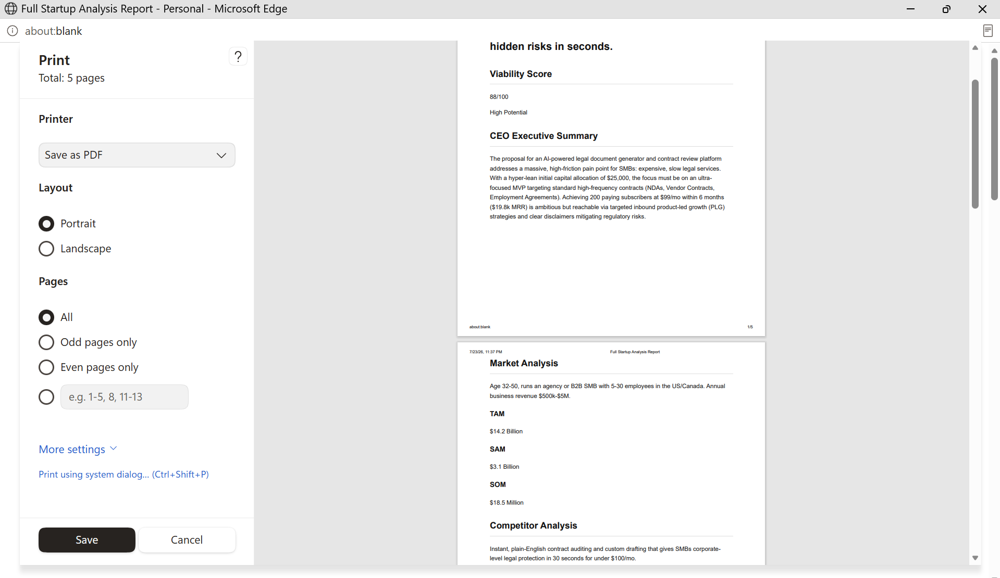

# 🚀 StartupForge AI — Multi-Agent Startup Builder

An AI-powered multi-agent platform where **7 specialized executive AI agents** collaborate to evaluate startup ideas, conduct market research, analyze competitors, structure business model canvases, model financial unit economics, and formulate actionable 12-month execution roadmaps.

---
## 🎯 Problem It Solves

Many aspiring entrepreneurs and students have startup ideas but struggle to evaluate:
- Is the idea financially viable?
- Who are the actual customers?
- Who are the competitors?
- What business model should they use?
- How much funding is required?

StartupForge AI solves this by providing an AI-powered virtual startup advisory team that analyzes ideas from multiple executive perspectives.

## 👥 Target Users

- Student entrepreneurs
- Early-stage founders
- Startup enthusiasts
- Small business owners
### 🏠 Screenshots








## 🌟 Key Features

### 🤵 The 7 Executive AI Agent Swarm
1. **CEO Agent (Marcus Vance)**
   - Synthesizes startup inputs, establishes strategic hypotheses, calculates overall Viability Score (0–100), and outputs a 12-month 3-phase execution roadmap.
2. **Market Research Agent (Elena Rostova)**
   - Maps target audience personas, calculates TAM / SAM / SOM market sizing in $ USD, and identifies macro industry trends.
3. **Competitor Intelligence Agent (Darius Thorne)**
   - Audits direct and indirect competitors, constructs feature comparison matrices, identifies unserved market gaps, and formulates the Unique Value Proposition (UVP).
4. **Business Model Agent (Sophia Chen)**
   - Drafts the standard 9-box Business Model Canvas (Key Partnerships, Value Props, Channels, Cost Structure, Revenue Streams) and structures tiered pricing models.
5. **Chief Marketing Agent (Jaxson Reed)**
   - Generates brand identity (names, taglines, voice), crafts a 3-phase Go-To-Market (GTM) launch strategy, and designs viral social media campaigns.
6. **Chief Financial Agent (Claire Sterling)**
   - Itemizes startup capital setup costs, projects monthly OPEX, models quarterly Year 1 cash flow, and calculates break-even timeline.
7. **Chief Risk & Compliance Agent (Vikram Patel)**
   - Evaluates product, market, financial, and regulatory/legal vulnerabilities, assigning severity/likelihood scores and actionable mitigations.

---

### 🛠️ Interactive Tools & Features
- **Live Multi-Agent Terminal Bus**: Watch the CEO agent assign tasks and stream simulated progress logs across all 7 agents in real time.
- **Interactive Break-Even Sensitivity Calculator**: Adjust subscription price and monthly OPEX sliders to instantly see real-time break-even subscriber requirements.
- **Interactive Recharts Visualizations**: Dynamic charts for quarterly financial performance (Revenue vs. Expenses) and TAM / SAM / SOM market sizing.
- **Executive Advisory Chat Hotline**: Engage in 1-on-1 follow-up Q&A chat directly with any of the 7 individual executive AI agents.
- **Sample Startup Presets**: Quick-start templates including *LegalDraft AI*, *FarmPulse Urban Farms*, *MushroomPack Eco-Boxes*, and *PulseSquad Social Fitness*.
- **Report Persistence & Export**: Save generated startup reports to local storage, export raw Markdown summaries, or print to clean PDF format.

---
## 🤖 AI Feature

StartupForge AI uses a multi-agent architecture powered by Gemini.

Each agent has a specialized role:

- CEO Agent: evaluates strategic viability
- Market Agent: researches TAM/SAM/SOM
- Finance Agent: creates financial projections
- Risk Agent: identifies business risks

### Example System Instruction

"You are a startup strategy expert. Analyze the given startup idea objectively. Evaluate market opportunity, customer segments, risks, and provide actionable recommendations."
## 🔄 How It Works

1. User enters startup idea
2. AI agents analyze different aspects
3. Reports are generated
4. User reviews business strategy
5. Reports can be saved/exported

## 🏗️ Technology Stack

- **Frontend**: React 19, TypeScript, Vite, Tailwind CSS v4, Lucide React icons, Recharts
- **Backend**: Express.js server (Node.js runtime) with `tsx` & `esbuild`
- **LLM / AI**: Google GenAI SDK (`@google/genai`) using model `gemini-3.6-flash`
- **Animations & Styling**: `@tailwindcss/vite`, `motion/react`

---

## ⚡ Quick Start & Development

### Prerequisites
- Node.js 20+
- `GEMINI_API_KEY` configured in environment variables or `.env`

### Installation

1. Install dependencies:
   ```bash
   npm install
   ```

2. Configure Environment Variables:
   Create a `.env` or `.env.local` file with your Gemini API Key:
   ```env
   GEMINI_API_KEY="your-gemini-api-key-here"
   ```

3. Start Development Server:
   ```bash
   npm run dev
   ```
   The application runs on `http://localhost:3000`.

4. Build for Production:
   ```bash
   npm run build
   npm start
   ```

---

## 📄 License

Apache-2.0 License.
